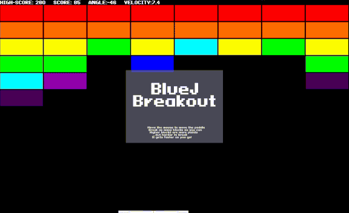

# BlueJ Breakout
> My final project for AP Computer Science A in 2022: a replica of Atari Breakout in Java



This project has several cool features:
1. The lower blocks are easier to break (1 hit), but you only get one point. The higher blocks are much harder to break (8 hits), but you get 8 points!
2. The ball speeds up as you gain points!
3. There is a persistent high score stored at `~/.breakout_high_score.txt` (or `%USERPROFILE%\.breakout_high_score.txt`)
4. I used public domain sound effects and the Pixeloid Sans font from [dafont.com/pixeloid-sans.font](https://www.dafont.com/pixeloid-sans.font)
5. I used a bunch of cool tenhniques using Swing to hide the cursor, make it fullscreen, etc.
6. It's fun and hard to play!

Install Instructions:
```shell
$ git clone https://github.com/cole-wilson/breakout
$ cd breakout
$ java Breakout.java
```
